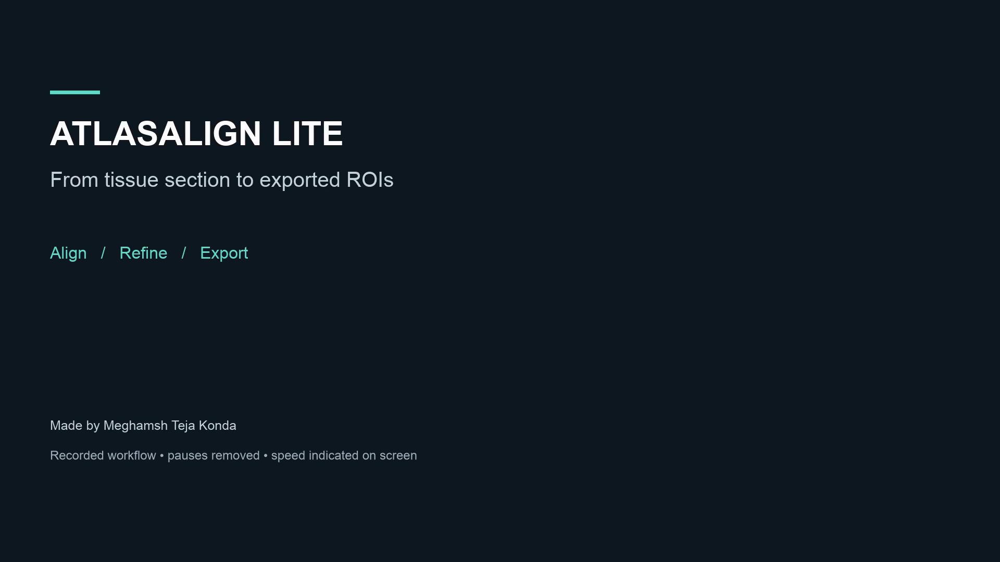

# AtlasAlign Lite — Open-source image alignment for Fiji / ImageJ

**Made by Meghamsh Teja Konda** · MIT project code · **0.1.0-beta.1**

AtlasAlign Lite is an **open-source image alignment and atlas registration
plugin for Fiji / ImageJ2**. It helps researchers align mouse brain microscopy
sections to the **Allen Mouse Brain Common Coordinate Framework (CCFv3)**,
review anatomical regions, and export regions of interest (ROIs) in the original
image coordinates. It supports single sections and resumable batches, including
multiple sections on one slide.

Open an image → choose a section → review alignment → select regions → export.
The original image stays read-only. Alignment previews use separate buffers;
acceptance and export include source-integrity checks. Anatomical decisions
remain the reviewer's responsibility.

## Image alignment and brain atlas registration

Designed for researchers working with mouse brain histology and microscopy,
including immunofluorescence (IF) images. The workflow combines:

- **Reviewer-controlled alignment:** choose an atlas plane and review tissue
  orientation, transforms and local refinement against your section image.
- **Anatomical ROI selection:** select and edit brain-region ROIs using the
  Allen CCFv3 atlas as a reference.
- **Source-coordinate exports:** export ROI images, crops and masks for further
  analysis while preserving the original source image.
- **Batch section review:** navigate multiple sections on one slide and save a
  project to resume the review later.

Here, image registration means aligning a tissue section with a brain atlas.
AtlasAlign focuses on this anatomical workflow; it does not provide general
photo stitching or fully automatic registration of arbitrary image pairs.
Every anatomical alignment requires human review.

## Watch the demo and try the example

[](https://github.com/meghamsh738/atlasalign/releases/download/v0.1.0-beta.1/atlasalign-workflow-demo.mp4)

**[Watch/download the demo (MP4, 3:10)](https://github.com/meghamsh738/atlasalign/releases/download/v0.1.0-beta.1/atlasalign-workflow-demo.mp4)** ·
**[Download the mock IF example (TIFF, 24.1 MiB)](https://github.com/meghamsh738/atlasalign/releases/download/v0.1.0-beta.1/mock-if-example.tif)** ·
**[Installation guide](docs/community/INSTALLATION.md)**

The video shows manual alignment, editable ROIs, actual exported crop/mask
previews, and a labeled batch-mode screenshot walkthrough. See the
[demo and example guide](docs/community/DEMO.md) for the steps and export locations.
Only the author's mock IF image is provided as a microscopy example; the batch
slide pictured in the video is not included. The footage uses an earlier review
UI and is a workflow demonstration, not an anatomical benchmark.

## Install and start

Requires **Fiji/ImageJ2 and Java 17 or newer**. Python is not required for manual
alignment. See [installation](docs/community/INSTALLATION.md), then
[quick start](docs/community/QUICKSTART.md).

1. Install the beta bundle into a separate, current Fiji installation and restart.
2. Choose **Plugins → AtlasAlign Lite → Atlas Setup**. Select a verified existing
   Allen 25 µm cache, or review the download terms and install it.
3. Open your image and choose **Review Atlas Alignment**, or add section marker
   ROIs and choose **Batch / Whole-Slide Review**.
4. Review the plane, tissue crop, orientation, alignment and anatomical regions.
   Accept the reviewed alignment before exporting.

The batch queue includes a clickable **Whole slide** overview beside the
selected-section preview. Matching numbers link outlines to rows; clicking
selects a row, and **Open** enters its review. Save the batch project to resume
later with the original source image open.

## Beta status

Download the **[0.1.0-beta.1 release](https://github.com/meghamsh738/atlasalign/releases/tag/v0.1.0-beta.1)**
and read the [release notes and validation status](docs/community/RELEASE_NOTES.md).
Automated tests, packaging and Java 17 loading checks passed on Windows, macOS
and Linux before release. See the [public build workflow](https://github.com/meghamsh738/atlasalign/actions/workflows/beta.yml).
Native macOS startup and the saved-batch workflow were checked; Windows/Linux
GUI and cross-platform DeepSlice compatibility are not certified.
A Fiji update site is not yet available; use the manual installation instructions.

Optional DeepSlice can propose a starting plane from copied preview pixels.
Manual setup remains available without it. See [optional DeepSlice](docs/community/DEEPSLICE.md).
Transforms, laterality, local refinement and anatomical ROIs require review;
there is no automatic confidence percentage.

## Build and contribute

Use Java 17+, Maven and Python 3.10+ for development:

```sh
./scripts/test.sh
python3 scripts/package_beta.py --output dist
```

On Windows use `python scripts/test.py` instead of the shell entry point.
`JAVA_HOME`, `MAVEN_BIN` and optional `MAVEN_REPOSITORY` select local tools.
See [contributing](CONTRIBUTING.md), [scientific invariants](docs/SCIENTIFIC_INVARIANTS.md)
and [transform conventions](docs/TRANSFORM_CONVENTIONS.md).

## Citation and terms

Use [CITATION.cff](CITATION.cff) for this software. Existing AtlasAlign Lite
contributor notices remain in [LICENSE](LICENSE). Fiji, ImageJ, SciJava,
Bio-Formats, Jackson, Allen atlas data and optional DeepSlice have separate
licenses or terms; see [third-party notices](THIRD_PARTY_NOTICES.md).
Author credit is confined to the plugin UI and project documentation, and is
not added to scientific exports.
